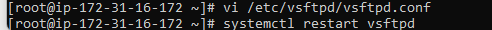

# Tutorial on Configuring your EC2 instance as an FTP server. 

## Full Step-by-Step guide with Snapshots to describe and illustrate how to configure an EC2 Instance as an FTP Server.

### **This project will display how to set up and configure an FTP server on an EC2 instance, including user creation, security group adjustments, and WinSCP access verification.**

*Create a new EC2 Instance 
* Log in to Linux Terminal via SSH on the EC2 instance
* Run Neccasary Configuration Files inside Linux and Vim Editor for configuration of the FTP Server to work with the EC2 Instance.
* Create a Username and Password in the Linux Terminal 
* Copy and paste the EC2 Instance Public IP Address in WinSCP, as well as enter the Username and Password created in the Linux Terminal into WinSCP
* Reconfigure both the security group inbound rules as well as the VIM Editor.
* Logging back into WinSCP after both the reconfiguration is complete for the Security Group and the VIM Editor.

#### Step-by-Step Instructions on how to set up and configure an FTP server on an EC2 instance, including user creation, security group adjustments, and WinSCP access verification.

Part 1

Launch EC2 instance

  

Choose instance name, AMI, type, and key pair

  
 
  

Edit the security group

  

View initial security group rules

  

Click launch at the bottom of the page

  

Connect to the instance

  

Select the SSH client tab

  

SSH into the instance using Command Prompt

  

Run sudo -i in Linux terminal

  

Run yum update -y and install vsftpd

  

Edit the vsftpd config file with Vim

  

Set anonymous_enable=YES in config

  

Uncomment ascii upload and download options

  

Start the vsftpd service

  

Check the vsftpd service status

  

Create a new user and set a password

  

Part 2

Copy the public IP from EC2 instance details

  

Enter IP, username, and password in WinSCP

  

Open the security tab and security group link in EC2 instance

  

Edit inbound rules in the security group

  
 
  

Reopen vsftpd config in Linux terminal

  

Paste configuration under listen=NO in Vim

  

Restart the vsftpd service

  

Retry WinSCP login with credentials

  

##### Contribution Policy

This project is not accepting external contributions, including pull requests or feature requests.

It serves as a personal archive of my learning journey in applying foundational concepts in software development and version control. Active development is not ongoing, and external changes will not be integrated.

