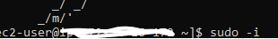
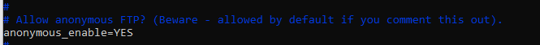
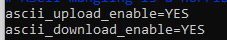

# Tutorial on Configuring your EC2 instance as an FTP server. 

## Full Step-by-Step guide with Snapshots to describe and illustrate how to configure an EC2 Instance as an FTP Server.

### **This project will display how to set up and configure an FTP server on an EC2 instance, including user creation, security group adjustments, and WinSCP access verification.**

*Create a new EC2 Instance 
* Log in to Linux Terminal via SSH on the EC2 instance
* Run Neccasary Configuration Files inside Linux and Vim Editor for configuration of the FTP Server to work with the EC2 Instance.
* Create a Username and Password in the Linux Terminal 
* Copy and paste the EC2 Instance Public IP Address in WinSCP, as well as enter the Username and Password created in the Linux Terminal into WinSCP
* Reconfigure both the security group inbound rules as well as the VIM Editor.
* Logging back into WinSCP after both the reconfiguration is complete for the Security Group and the VIM Editor.

#### Step-by-Step Instructions on how to set up and configure an FTP server on an EC2 instance, including user creation, security group adjustments, and WinSCP access verification.

**Part1**
Launch EC2 instance → choose Name, AMI, Key Pair, Security Group → click Launch.

Select instance → Connect → SSH Client → copy SSH code → open Command Prompt (Admin) → paste code & press Enter.

In Linux terminal: sudo -i, yum update -y, yum install vsftpd, vi /etc/vsftpd/vsftpd.conf.

In Vim: press Shift+I, change anonymous_enable=NO → YES, uncomment ascii_upload_enable=YES & ascii_download_enable=YES, then Esc :wq Enter.

Back in terminal: systemctl start vsftpd, systemctl status vsftpd (check active), then run useradd <username> & passwd <username> to create login.

![Connect to your Instance VIA SSH in Command Prompt] (resources/EC2RELATEDPASTESSSHINSTANCEINTOCOMMANDPROMPT.png)

**Part2**

* Go back to your EC2 Instance, Select it, Copy the Public IP Address in the Details Section> Open WinSCP from the search tab on Windows (no photo)> In the WinSCP Window, click on New Site, In the Host Name Box, put your EC2 Public IP Address(that you copied over before) as well as put your Username and Password (that you created in Linux earlier) in their respective boxes>  
* Go back again to your EC2 Instance, Select It, Go Down on the Page, and Select Both the Security Tab and the clickable link of the Security Group>Edit the Inbound Rules to be displayed. (as shown in the attached photo.)
*Go back to your Linux Terminal and type both the following 2 commands: 1)sudo -i 2) vi /etc/vsftpd/vsftpd.conf>. Inside your VIM Editor, hit SHIFT + I to enter Insert Mode, scroll down below where it says "listen=NO and paste the following commands (as shown in the attached photo).> Followed by pressing ESC, followed by:wq and ENTER.> type "systemctl restart vsftpd" to restart the terminal.
*Go back to the WinSCP tab and type in both your Username and Password, and the connection will likely be successful. 

##### Contribution Policy

This project is not accepting external contributions, including pull requests or feature requests.

It serves as a personal archive of my learning journey in applying foundational concepts in software development and version control. Active development is not ongoing, and external changes will not be integrated.
